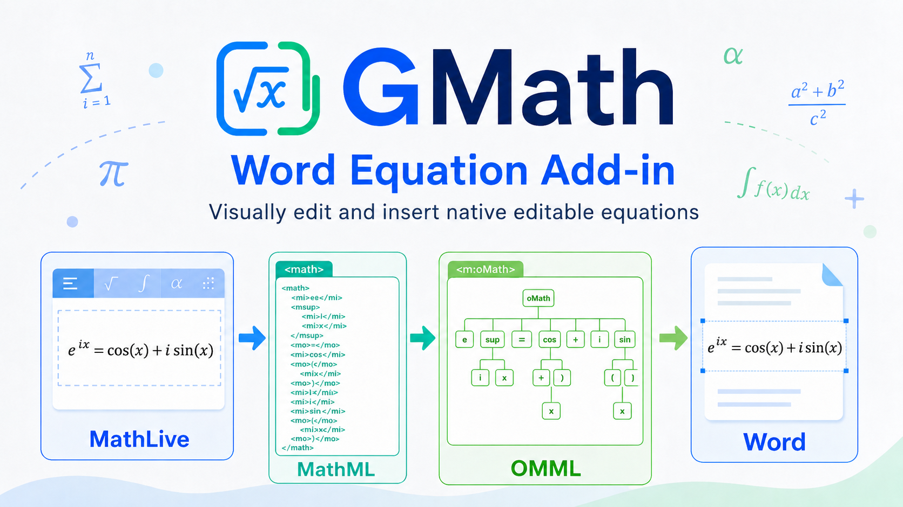

# GMath



GMath is a Microsoft Word add-in for writing editable math equations.

You can compose an equation visually, use quick symbol buttons, or type LaTeX. GMath inserts the result as a native Word equation, not as an image, so it remains editable in the document.

中文说明见 [READMEZH.md](READMEZH.md).

## Current Platform

GMath is currently set up for **Microsoft Word on macOS**.

The included sideload command copies the manifest to Word's macOS add-in folder. Windows sideloading is not packaged in this repository yet.

## What Works Without a Local Server

After sideloading, the main add-in UI loads from GitHub Pages:

```text
https://ge-shun.github.io/GMath/src/taskpane.html
```

Word needs network access to open that hosted task pane. It does not need a local background service. Once the task pane is loaded, equation editing and insertion run in the task pane and Word.

These features do not require a local service to keep running:

- Visual equation editing
- LaTeX editing and preview
- Symbol quick-pick buttons
- Inline, display, and numbered equation insertion
- Native editable Word equations

Image-to-formula may need a temporary local proxy if your API provider blocks browser CORS requests. See [Image To Formula](#image-to-formula).

## Install on Mac

Requirements:

- macOS
- Microsoft Word for Mac
- Node.js and npm

From the project folder, install dependencies once:

```bash
npm install
```

Then sideload the add-in into Word:

```bash
npm run sideload:mac
```

Completely quit Word with `Cmd+Q`, then open Word again. You should see **GMath** on the **Home** tab.

If Word still shows an older UI after an update, run `npm run sideload:mac` again and fully restart Word. Office can cache add-in manifests and task panes.

## Use GMath

1. Open Word.
2. Go to **Home** > **GMath** > **Insert Equation**.
3. Enter an equation in the task pane using the visual editor, symbol buttons, or LaTeX source.
4. Choose **Inline**, **Display**, or **Numbered**.
5. Click **Insert into Word**.

The inserted equation is a Word equation and can be edited later in Word.

## Image To Formula

Image-to-formula sends the selected image to the OpenAI-compatible vision API you configure under **API Settings**.

You need:

- An API endpoint, for example `https://api.openai.com/v1/chat/completions`, or a provider base URL ending in `/v1`
- An API key
- A model that supports image or vision input

The API key and endpoint are stored only in the local browser storage used by the task pane. During recognition, the image and key are sent to the API provider you configured.

### When It Works Directly

If the API provider allows browser requests, no local service is needed. Fill in **API Settings**, paste or choose an image, and run recognition.

### If It Shows `Load failed`

Many API providers do not allow direct browser requests because of CORS. In that case, start the temporary local proxy.

First time only:

```bash
npm run dev-certs
```

Then start the proxy:

```bash
npm run serve
```

Keep that terminal open while using image recognition. The add-in will retry through:

```text
https://localhost:3000/api/ai/chat/completions
```

Stop the server when you are done. GMath does not install a persistent background service.

## Run Locally

Most users do not need this section.

Run locally only when you want to test local page changes or force Word to load the task pane from `localhost`.

First time only:

```bash
npm run dev-certs
```

Terminal 1:

```bash
npm run serve
```

Terminal 2:

```bash
npm run sideload:mac:local
```

Then fully restart Word. This points Word at:

```text
https://localhost:3000/src/taskpane.html
```

Keep `npm run serve` running while using the local task pane.

To switch back to the GitHub Pages version:

```bash
npm run sideload:mac
```

Then fully restart Word again.

## Troubleshooting

If **GMath** does not appear in Word, run `npm run sideload:mac` and restart Word with `Cmd+Q`.

If the task pane is blank while using the normal GitHub Pages version, check your network connection and restart Word. You do not need `npm run serve` for the normal UI.

If the task pane is blank while using `sideload:mac:local`, make sure `npm run serve` is still running and the localhost certificate has been installed with `npm run dev-certs`.

If image recognition shows `Load failed`, run `npm run serve` temporarily and try again. Also confirm that the API URL is OpenAI-compatible and the model supports image input.

If an equation inserts incorrectly, open the debug section at the bottom of the task pane and inspect the generated MathML / OMML. Some advanced structures may not be supported yet.

## Remove the Add-in

On macOS, remove the sideloaded manifest:

```bash
rm ~/Library/Containers/com.microsoft.Word/Data/Documents/wef/manifest.xml
```

Then restart Word.

## Third-Party Software

GMath uses MathLive for visual equation editing. MathLive is licensed under the MIT License.
